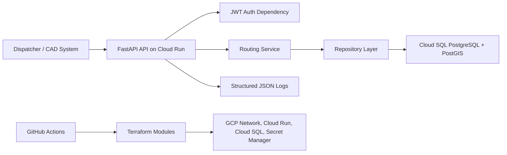

# EmergencyPulse Architecture

## Design Notes

- FastAPI was selected for low-latency async IO, first-class OpenAPI generation, Pydantic validation, and Python geospatial ecosystem compatibility.
- PostgreSQL with PostGIS stores generated geography columns and GIST indexes for spatial queries while keeping app models lightweight.
- The routing service is pure and replaceable. The included heuristic is deterministic, sub-second, and suitable for initial dispatch scoring; production map matching can be added behind the same service boundary.
- Terraform is split into network, database, and compute modules to keep environments repeatable and reviewable.
- GitHub Actions separates CI validation from manually gated deployments.
